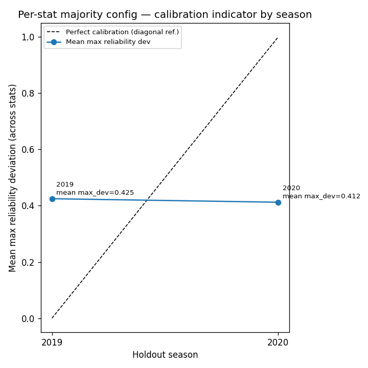

# Cross-Season Training Summary (Phase H4)

**Holdout seasons loaded:** [np.int64(2019), np.int64(2020)]
**Total distinct configs in grid:** 144

## Per-stat majority config (H5 primary)

Each row is the `config_hash` that **won on the most holdout seasons** for that stat 
(lowest holdout `log_loss` among valid fits per season). 
Ties use lower **pooled mean** `log_loss` across all loaded seasons for that triple.

Full table: [`per_stat_majority_config.csv`](per_stat_majority_config.csv)

| position | stat | config_hash | vote_count | holdout_seasons_available | winning_seasons | mean_log_loss_pooled | k | l1_alpha | dist_family | use_weather |
| --- | --- | --- | --- | --- | --- | --- | --- | --- | --- | --- |
| qb | completions | 4ad79b219c249946 | 1 | 2 | 2019 | 0.755939594398867 | 12 | 0.0 | count_aware | True |
| qb | interceptions | d4534384749123ac | 1 | 2 | 2020 | 0.6045557126873788 | 16 | 0.0 | count_aware | True |
| qb | passing_tds | 677259fe0974c41b | 1 | 2 | 2020 | 0.6570046896316019 | 2 | 0.0 | count_aware | False |
| qb | passing_yards | 156ea763d8ab7e66 | 1 | 2 | 2019 | 0.7713285171233953 | 16 | 0.0 | decomposed | True |
| rb | carries | f73ca2adc4e369b3 | 1 | 2 | 2019 | 2.864087715392054 | 2 | 0.0 | count_aware | True |
| rb | rushing_tds | c2447cee46a2028c | 1 | 2 | 2019 | 0.5280019011280629 | 2 | 0.001 | legacy | True |
| rb | rushing_yards | a271332f2ca0b329 | 1 | 2 | 2020 | 1.2755136691906348 | 2 | 0.001 | decomposed | True |
| wr_te | receiving_tds | c2447cee46a2028c | 1 | 2 | 2020 | 0.5003022543857616 | 2 | 0.001 | legacy | True |
| wr_te | receiving_yards | a5392e02009fcdf7 | 1 | 2 | 2019 | 0.8473919589600429 | 2 | 0.01 | count_aware | False |
| wr_te | receptions | fff405a0021bafd9 | 2 | 2 | 2019,2020 | 0.8393927059492372 | 2 | 0.0 | decomposed | True |

## Reference: global mean-variance config (single-config benchmark)

Same ranking as before Phase H4 — **not** the recommended production default when using per-stat configs.

| Knob | Value |
|------|-------|
| config_hash | `b80a43f0cb818fbc` |
| use_weather | False |
| dist_family | decomposed |
| k | 2 |
| l1_alpha | 0.0 |

**Mean holdout log-loss:** 0.9640
**Std across seasons:** 0.0000
**Selection score (mean + 0.5×std):** 0.9640

## Top 10 global benchmark configs by score

| config_hash | use_weather | dist_family | k | l1_alpha | use_opponent_epa | use_rest_days | use_home_away | mean_ll | std_ll | score |
| --- | --- | --- | --- | --- | --- | --- | --- | --- | --- | --- |
| b80a43f0cb818fbc | False | decomposed | 2 | 0.0 | False | False | False | 0.9639814132366308 | 0.0 | 0.9639814132366308 |
| ac081e42691b71b8 | False | decomposed | 4 | 0.0 | False | False | False | 0.9661985538366326 | 0.0 | 0.9661985538366326 |
| fff405a0021bafd9 | True | decomposed | 2 | 0.0 | False | False | False | 0.965853895662133 | 0.002627368590588128 | 0.9671675799574271 |
| f344212486d2dd69 | False | decomposed | 6 | 0.0 | False | False | False | 0.9694432617276958 | 0.0 | 0.9694432617276958 |
| 60f9b63bd66191e9 | True | decomposed | 4 | 0.0 | False | False | False | 0.9693018694511131 | 0.004378793473767369 | 0.9714912661879967 |
| 05e697739e38db94 | False | decomposed | 8 | 0.0 | False | False | False | 0.9727168018595297 | 0.0 | 0.9727168018595297 |
| 714b8cf648e5f86e | True | decomposed | 6 | 0.0 | False | False | False | 0.9729642796122289 | 0.004978670708184294 | 0.975453614966321 |
| 34792ceac2c12e5f | False | decomposed | 12 | 0.0 | False | False | False | 0.9778563958562481 | 0.0 | 0.9778563958562481 |
| 26bc4e3052b4bcad | True | decomposed | 8 | 0.0 | False | False | False | 0.9760978681055472 | 0.004795077343554621 | 0.9784954067773245 |
| 677259fe0974c41b | False | count_aware | 2 | 0.0 | False | False | False | 0.9761868033043978 | 0.004784331674962195 | 0.9785789691418789 |

## Ablation findings

- Weather on vs off: -0.0202 (helps; on=1.0360, off=1.0562)
- Dist family log-loss: legacy=1.0289, count_aware=1.0647, decomposed=1.0472
- Opponent EPA / rest days / home-away: deferred to H2.1

## Pooled-across-seasons argmin per (position, stat) (secondary reference)

If you first **average** `log_loss` across all seasons and then pick a single winner, you get 
(possibly different) configs — useful for comparison, not the H5 majority vote.

| position | stat | dist_family | k | l1_alpha | use_weather | mean_ll |
| --- | --- | --- | --- | --- | --- | --- |
| qb | completions | count_aware | 12 | 0.0 | False | 0.7310322455153421 |
| qb | interceptions | count_aware | 16 | 0.01 | True | 0.6037977845455169 |
| qb | passing_tds | decomposed | 4 | 0.0 | False | 0.6502911664197495 |
| qb | passing_yards | decomposed | 16 | 0.0 | False | 0.736580151152638 |
| rb | carries | count_aware | 2 | 0.0 | False | 2.864087715392054 |
| rb | rushing_tds | legacy | 2 | 0.001 | True | 0.5280019011280629 |
| rb | rushing_yards | decomposed | 2 | 0.01 | False | 1.2678262938118072 |
| wr_te | receiving_tds | decomposed | 2 | 0.01 | False | 0.4950232929597917 |
| wr_te | receiving_yards | decomposed | 2 | 0.01 | False | 0.8473919589600429 |
| wr_te | receptions | decomposed | 2 | 0.0 | False | 0.8353654589686216 |

## Reliability overlay

## Model gates (for H5 lock-in)

**Primary:** `per_stat_majority_config.csv` — one `config_hash` per `(position, stat)` from
majority vote across walk-forward holdouts. Implement routing in model code so each stat uses
its own knobs (`k`, `l1_alpha`, `dist_family`, feature flags).

| Flag | Current default | H5 decision basis |
|------|-----------------|-------------------|
| `NFL_APP_USE_FUTURE_ROW` | `false` | Review per-stat `dist_family` in the majority table |
| `NFL_APP_USE_CALIBRATION` | unset | Enable if mean `max_reliability_dev` for locked per-stat configs is persistently high |
| `use_weather` | `false` | Take from each stat's winning row (can differ by stat) |
| `k`, `l1_alpha` | position defaults | Take **per stat** from the majority table |

The global mean-variance config in this report is **not** the production default — it is a
single-config benchmark only.

## Rollup observations

(LLM unavailable: HTTPConnectionPool(host='localhost', port=8080): Max retries exceeded with url: /v1/completions (Caused by NewConnectionError("HTTPConnection(host='localhost', port=8080): Failed to establish a new connection: [WinError 10061] No connection could be made because the target machine actively refused it")))
