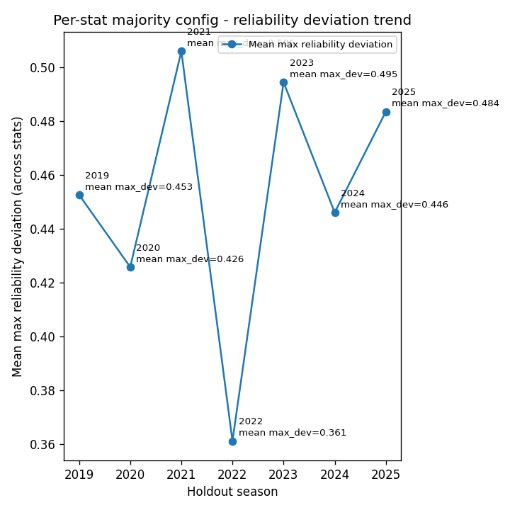

# Cross-Season Training Summary (Phase H4)

**Holdout seasons loaded:** [2019, 2020, 2021, 2022, 2023, 2024, 2025]
**Total distinct configs in grid:** 144

## Per-stat majority config (H5 primary)

Each row is the `config_hash` that **won on the most holdout seasons** for that stat 
(lowest holdout `log_loss` among valid fits per season). 
Ties use lower **n_holdout-weighted pooled mean** `log_loss` across all loaded seasons for that triple.

Full table: [`per_stat_majority_config.csv`](per_stat_majority_config.csv)

| position | stat | config_hash | vote_count | holdout_seasons_available | winning_seasons | mean_log_loss_pooled | k | l1_alpha | dist_family | use_weather |
| --- | --- | --- | --- | --- | --- | --- | --- | --- | --- | --- |
| qb | completions | 677259fe0974c41b | 4 | 7 | 2020,2021,2023,2024 | 0.7471031307898602 | 2 | 0.0 | count_aware | False |
| qb | interceptions | 46a85a426435e5a4 | 1 | 7 | 2022 | 0.5990633563192711 | 16 | 0.1 | count_aware | True |
| qb | passing_tds | 677259fe0974c41b | 1 | 7 | 2020 | 0.6584128812484715 | 2 | 0.0 | count_aware | False |
| qb | passing_yards | fff405a0021bafd9 | 1 | 7 | 2025 | 0.7571822569507077 | 2 | 0.0 | decomposed | True |
| rb | carries | f73ca2adc4e369b3 | 3 | 7 | 2019,2022,2025 | 2.5477038208577487 | 2 | 0.0 | count_aware | True |
| rb | rushing_tds | bf21288bdaf831d1 | 2 | 7 | 2020,2022 | 0.5226497709408886 | 2 | 0.001 | count_aware | True |
| rb | rushing_yards | bb80bdf42e1e317f | 1 | 7 | 2020 | 1.1183030933134082 | 6 | 0.01 | decomposed | False |
| wr_te | receiving_tds | 2d7e7b96b1b914db | 2 | 7 | 2021,2024 | 0.48177544633214237 | 2 | 0.0 | legacy | True |
| wr_te | receiving_yards | 0dcee42e0156a3e8 | 4 | 7 | 2021,2022,2023,2025 | 0.7950666303842262 | 2 | 0.1 | count_aware | False |
| wr_te | receptions | fff405a0021bafd9 | 5 | 7 | 2019,2021,2022,2024,2025 | 0.8019538403567877 | 2 | 0.0 | decomposed | True |

## Reference: global mean-variance config (single-config benchmark)

Same ranking as before Phase H4 — **not** the recommended production default when using per-stat configs.

| Knob | Value |
|------|-------|
| config_hash | `b80a43f0cb818fbc` |
| use_weather | False |
| dist_family | decomposed |
| k | 2 |
| l1_alpha | 0.0 |

**Mean holdout log-loss:** 0.9059
**Std across seasons:** 0.0422
**Selection score (mean + 0.5×std):** 0.9270

## Top 10 global benchmark configs by score

| config_hash | use_weather | dist_family | k | l1_alpha | use_opponent_epa | use_rest_days | use_home_away | mean_ll | std_ll | score |
| --- | --- | --- | --- | --- | --- | --- | --- | --- | --- | --- |
| b80a43f0cb818fbc | False | decomposed | 2 | 0.0 | False | False | False | 0.9058975913648931 | 0.04221195633337985 | 0.927003569531583 |
| fff405a0021bafd9 | True | decomposed | 2 | 0.0 | False | False | False | 0.9058964862387141 | 0.0422172189040328 | 0.9270050956907305 |
| 60f9b63bd66191e9 | True | decomposed | 4 | 0.0 | False | False | False | 0.9101792620567926 | 0.041587748098566545 | 0.9309731361060758 |
| ac081e42691b71b8 | False | decomposed | 4 | 0.0 | False | False | False | 0.9101845500073823 | 0.041580930202800376 | 0.9309750151087824 |
| 34792ceac2c12e5f | False | decomposed | 12 | 0.0 | False | False | False | 0.9158193291396849 | 0.03150974366447858 | 0.9315742009719242 |
| 677259fe0974c41b | False | count_aware | 2 | 0.0 | False | False | False | 0.9086511858662788 | 0.04761724304265447 | 0.932459807387606 |
| f73ca2adc4e369b3 | True | count_aware | 2 | 0.0 | False | False | False | 0.9086538065086199 | 0.047621944062287105 | 0.9324647785397635 |
| f344212486d2dd69 | False | decomposed | 6 | 0.0 | False | False | False | 0.9143637914226145 | 0.04124437523826945 | 0.9349859790417492 |
| 714b8cf648e5f86e | True | decomposed | 6 | 0.0 | False | False | False | 0.9143619490464905 | 0.04125058935335544 | 0.9349872437231682 |
| 1caff0a0a167332a | False | decomposed | 16 | 0.0 | False | False | False | 0.9206742936757484 | 0.031689147337462496 | 0.9365188673444796 |

## Ablation findings

- Weather on vs off: +0.0014 (hurts; on=0.9444, off=0.9430)
- Dist family log-loss: legacy=0.9648, count_aware=0.9400, decomposed=0.9255
- Opponent EPA / rest days / home-away: deferred to H2.1

## Pooled-across-seasons argmin per (position, stat) (secondary reference)

If you first pool `log_loss` across all seasons with `n_holdout` weights and then pick a single winner, you get 
(possibly different) configs — useful for comparison, not the H5 majority vote.

| position | stat | dist_family | k | l1_alpha | use_weather | mean_ll |
| --- | --- | --- | --- | --- | --- | --- |
| qb | completions | count_aware | 2 | 0.0 | True | 0.7471028174795934 |
| qb | interceptions | decomposed | 16 | 0.1 | False | 0.5990348553342096 |
| qb | passing_tds | count_aware | 2 | 0.0 | False | 0.6584128812484715 |
| qb | passing_yards | decomposed | 2 | 0.0 | True | 0.7571822569507077 |
| rb | carries | decomposed | 6 | 0.01 | False | 2.5190295745483082 |
| rb | rushing_tds | legacy | 2 | 0.0 | True | 0.5225761173090921 |
| rb | rushing_yards | decomposed | 6 | 0.01 | False | 1.1183030933134082 |
| wr_te | receiving_tds | legacy | 2 | 0.0 | True | 0.48177544633214237 |
| wr_te | receiving_yards | decomposed | 2 | 0.1 | True | 0.7950662096998102 |
| wr_te | receptions | decomposed | 2 | 0.0 | False | 0.8019538403567877 |

## Reliability deviation trend

## Model gates (for H5 lock-in)

**Primary:** `per_stat_majority_config.csv` — one `config_hash` per `(position, stat)` from
majority vote across walk-forward holdouts. Implement routing in model code so each stat uses
its own knobs (`k`, `l1_alpha`, `dist_family`, feature flags).

| Flag | Current default | H5 decision basis |
|------|-----------------|-------------------|
| `NFL_APP_USE_FUTURE_ROW` | `false` | Review per-stat `dist_family` in the majority table |
| `NFL_APP_USE_CALIBRATION` | unset | Enable if mean `max_reliability_dev` for locked per-stat configs is persistently high |
| `use_weather` | `false` | Take from each stat's winning row (can differ by stat) |
| `k`, `l1_alpha` | position defaults | Take **per stat** from the majority table |

The global mean-variance config in this report is **not** the production default — it is a
single-config benchmark only.

## Rollup observations

(LLM unavailable: HTTPConnectionPool(host='localhost', port=8080): Max retries exceeded with url: /v1/completions (Caused by NewConnectionError("HTTPConnection(host='localhost', port=8080): Failed to establish a new connection: [WinError 10061] No connection could be made because the target machine actively refused it")))
